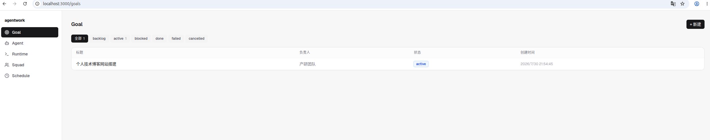

# agentwork

> [中文](README.zh.md) | [Design](DESIGN.md) | [设计 (中文)](DESIGN.zh.md)

A multi-protocol AI agent task management and scheduling platform. Orchestrate
CLI agents (Claude Code, Codex, OpenCode, custom agents) — create goals, assign
them to agents or squads, and let the daemon schedule and execute runs
automatically.

**Single process, single machine, single user, no auth.** Local SQLite for
persistence, in-process event bus. Batteries included: daemon, CLI, and a
Next.js web UI.

- **Multi-protocol** — ACP, JSONL, JSON-RPC
- **Multi-transport** — stdio, WebSocket, TCP
- **Goal/Run two-layer architecture** — goals own state authority, runs are
  execution records
- **Squad collaboration** — group agents into squads with a leader for
  delegation
- **Cron scheduling** — recurring goal creation on a schedule
- **Real-time Web UI** — live event stream via WebSocket

> **One-line mental model:** A goal is a work item (who owns it, how far it's
> progressed); a run is one execution (some agent's turn on it). The same goal
> may be executed many times and handed off across agents, with full history
> retained. A run has no authority — status is arbitrated by the goal layer.

## Quick start

### Prerequisites

- Go 1.26+
- Node.js 20+
- npm 10+

### Backend

```bash
# Build
go build -o agentwork-daemon ./cmd/agentwork-daemon
go build -o agentwork-cli ./cmd/agentwork-cli

# Start the daemon (default :7373)
./agentwork-daemon
```

### Frontend

```bash
cd web
npm install
npm run dev
```

Open **http://localhost:3000** and create your first Runtime, Agent, and Goal
through the UI.



## Core concepts

| Concept | What it is |
|---|---|
| **Runtime** | A launch spec — how to connect to a protocol-speaking program. `transport` (stdio/ws/tcp) + `executable`+`args` or `endpoint` + `env`. |
| **Provider** | A protocol kind — which wire protocol the agent speaks. `acp` / `jsonl` / `jsonrpc`. A field on the runtime. |
| **Agent** | A runtime + a persona (system_prompt / model / workdir / max_concurrent). The concurrency unit: each agent has a worker + semaphore. |
| **Squad** | A routing group that does no work itself. Has a leader (an agent). Assigning to a squad routes to the leader, who delegates sub-goals. |
| **Goal** | A work item (product plane). Assignable to an agent / squad / human. Has a state machine and optional `parent_id` for sub-goal coordination. **The sole holder of state authority.** |
| **Run** | One execution (execution plane): one agent's turn on one goal. On terminal status it reports to the goal layer — never writes goal status directly. |

## Architecture

```
┌──────────────────────────────────────────────────────────┐
│  agentwork-daemon (single process)                        │
│                                                           │
│  HTTP API + WS hub  ──→  service layer  ──→  store(SQLite) │
│        │                       │                           │
│        │                       │ bus.Publish (after commit)│
│        ▼                       ▼                           │
│      WS fan-out            daemon scheduler                │
│  (frontend / cli)          claim run → runTask             │
│                                  │  by runtime.provider     │
│                                  ▼                          │
│                           runtime.Open(spec)               │
│                                  │  returns transport R/W    │
│                                  ▼                          │
│                           backend.Execute(Session)         │
│                                  │  acp|jsonl|jsonrpc        │
│                                  ▼                          │
│                           agent CLI subprocess             │
│                                  │ calls agentwork-cli      │
│                                  ▼  (+ env: SERVER_URL…)    │
└──────────────────────────────────┼─────────────────────-─-┘
                                   ▼
                          agentwork-cli (agent-side tool)
```

## CLI tool

`agentwork-cli` is the agent-side tool. The daemon injects it into each agent
subprocess so agents can call back to produce structured side effects.

| Command | Description |
|---|---|
| `goal list` | List all goals (JSON) |
| `goal create --title T [--description D] [--assignee A] [--parent P] [--status S]` | Create a sub-goal |
| `goal assign <to-agent-id> [--note N]` | Hand off the current goal to another agent |
| `goal comment --text T [--role R]` | Post a comment; may contain `[@Name](mention://agent/<id>)` to enqueue a run on that agent |
| `goal wait` | Mark the current goal as waiting for its sub-goals |
| `agent list` | List all agents (JSON) |
| `squad list` | List all squads (JSON) |

The daemon sets these environment variables for every agent subprocess:
`AGENTWORK_SERVER_URL`, `AGENTWORK_GOAL_ID`, `AGENTWORK_RUN_ID`,
`AGENTWORK_AGENT_ID`.

## Tech stack

| Layer | Stack |
|---|---|
| **Backend** | Go 1.26, SQLite (modernc), gorilla/websocket, robfig/cron |
| **Frontend** | Next.js 16, React 19, Tailwind CSS 4, TanStack React Query |
| **Protocols** | ACP, JSONL, JSON-RPC |
| **Transports** | stdio, WebSocket, TCP |
